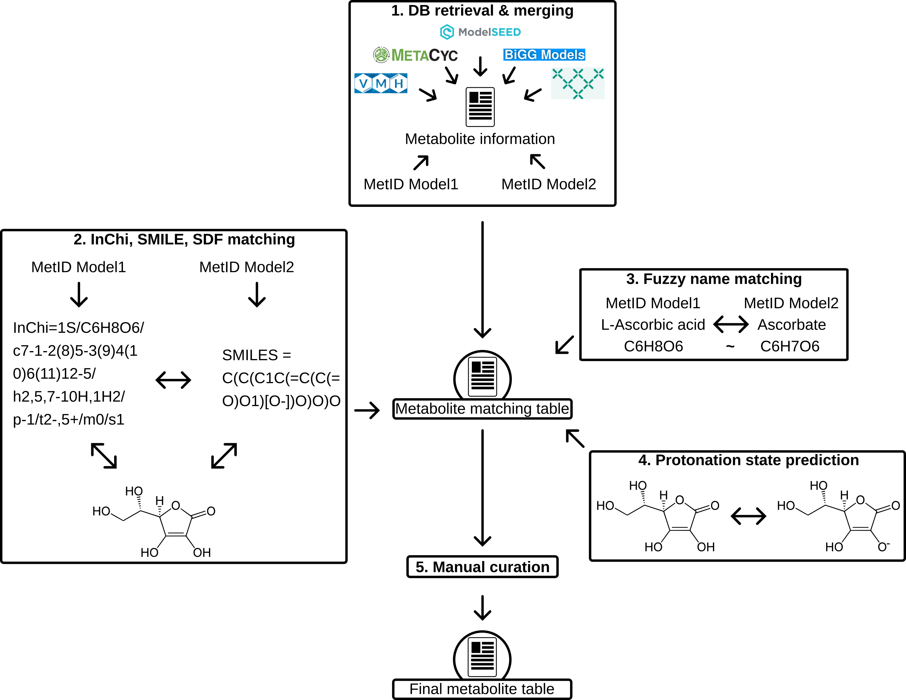

# Introduction

A major component of the MeMoMe package is the metabolite matching of the models which should be merged. This document should outline the general approach how to achieve that in a (semi-) automated way.

The metabolite matching will be based on 4-5 modules which will gather information about the metabolites in the models and use this information to make an educated guess how metabolites need to be matched between the models. 

1. Database searches
2. InChi, SMILE, SDF matching
3. Fuzzy name + sum formula matching
4. Protonation state control 
5. Manual curation

## General resources

+ [A comprehensive list of tools in drug discovery](https://opensourcemolecularmodeling.github.io/)

## Flowchart

# Data base matching

The idea is to generate a conversion table between the identifiers for the metabolites in the different databases and to have a data foundation to base further analysis on. With this conversion table and the different databases we will try to get as much information as possible about the metabolites of the models which we try to merge. This includes a simple 1:1 matching of the metabolite names in the models to the ids in the databases.

## Data bases

- [VMH](https://www.vmh.life)
- [metaCyc](https://metacyc.org/)
- [ModelSEED](https://www.modelseed.org/)
- [BiGG Models](http://bigg.ucsd.edu/)
- [Metabolic Atlas](https://metabolicatlas.org/)
- [gapseq](https://github.com/jotech/gapseq)
- [MetaNetEx](https://www.metanetx.org/)

# InChi, SMILE, SDF matching

The idea of the InChi and SMILE matching is based on information we can retrieve from the databases or which are stored directly in the model. If it is possible to obtain and InChi or SMILE key for the metabolites in the models, we can use this to directly match the metabolites of the two models based. There are software packages which can help with this.

There is a [chemoinformatics course by OLCC](http://olcc.ccce.divched.org/Spring2017OLCC) which is a great resource explaining how to do the data representation of chemical formulas in machines.

## Package and websites to consider

+ [PubChemPy](https://pubchempy.readthedocs.io/en/latest/)
    - wrapper for the API to access the pubchem data base for name2structure functions and ID conversions
+ [ChemSpiPy](https://chemspipy.readthedocs.io/en/latest/)
    + wrapper for the API to access the ChemSpider online tool for ID and SDF file conversion
+ [ChemSpider](https://www.chemspider.com/About.aspx)
    + website providing the tool for ID and SDF conversion
+ [cactus id converter](https://cactus.nci.nih.gov/chemical/structure)
    + another conversion tool between IDs and SDF file formats, among other formats
+ [RDKit](https://rdkit.org/)
    + huge library to handle chemical data in programming languages
+ [babel](https://openbabel.org/wiki/Main_Page)
    + software package for conversion of different structure files of chemical data
    + provides functionality to look for substructures within a structure

# Fuzzy name and sum formula matching

This module is kind of the last resort if no chemical formula can be retrieved (neither from the model itself, a matching database entry, nor a name2structure function function of the different tools above.

The idea is to simply use a fuzzy name matching algorithm to find the metabolite by name in the two models and try to use the sum formula of both to match them or to match them to a data base entry of module 1.

## Packages and resources

+ [Levenshtein package](https://maxbachmann.github.io/Levenshtein/)
    + implements the calculation of the Levenshtein distance between words and phrases to evaluate similarity between them
+ [FuzzyWuzzy](https://pypi.org/project/fuzzywuzzy/)
    + based on the Levenshtein distance but has more pre and postprocessing of the distances under the hood
+ [Tutorial for FuzzyWuzzy and Levenshtein](https://www.datacamp.com/tutorial/fuzzy-string-python)
+ [Metaphone](https://pypi.org/project/Metaphone/)
    + Metaphone does not rely on string matching but on sound matching of the strings
+ [(lengthy) tutorial for Metaphone](https://towardsdatascience.com/python-tutorial-fuzzy-name-matching-algorithms-7a6f43322cc5)

# Protonation state handling

In previous merging attempts a common problem was the usage of different protonation states for the metabolites coming from the two models. This causes problems with futile cycles, as it can create a free proton gradient, if not handled properly. One idea to handle the problem would be to rely on the prediction of the pKa based on the metabolite structure and the most likely pH. However, this is not trivial, but packages which do this exist as well as databases.

## Resources

+ [Paper comparing different software solutions](http://dx.doi.org/10.1021/ci900289x)
+ [ADME Boxes](https://doi.org/10.1002/cbdv.200900153)
    + second best performing software tool in the review
+ [ACD/pKa DB](https://www.acdlabs.com/products/percepta-platform/physchem-suite/pka/)
    + best performing tool, not open source and proprietary
+ [SPARC 4.2](https://pubs.acs.org/doi/10.1021/es100437g)
    + third best performing tool in the publication above, seems to be not longer maintained
+ other solutions [propka](propka.org)([github](https://github.com/jensengroup/propka-3.1)),  [ADMET Predictor](https://www.simulations-plus.com/software/admetpredictor/)     
+ [Newer paper comparing software tools](https://pubs.acs.org/doi/10.1021/es100437g)
+ [H++](http://newbiophysics.cs.vt.edu/H++/)
    + online resource that calculates protonation, but designed for proteins
    
# Manual curation

The idea of module 1-4 is to generate a table of metabolite matches between the two models which are associated with a kind of score of confidence how sure the algorithm is, that the match is a match based on the information gathered in these modules. This output can than be manually curated before it will be integrated in the name adjustment algorithm. 
